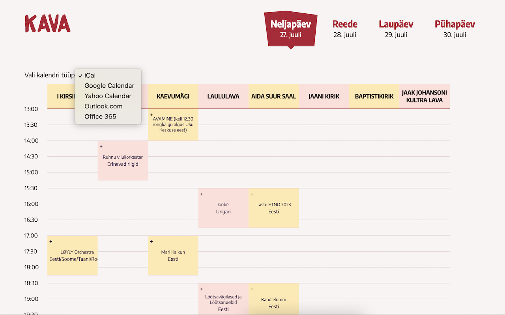

# FolkChrome Google Chrome browser extension

**Unofficial [Viljandi Folk](https://www.viljandifolk.ee/)** schedule extension that allows you to easily create calendar events from the schedule. Supports Google Calendar, iCal format (ICS), Office 365, Outlook and Yahoo! Calendar. Built because I am too lazy to fill in the schedule in my calendar every single year, so I was looking for a way to simplify it.

Actually only adds a select field to choose calendar type (ICS by default) and a small "+" anchor link to every concert in the schedule that allows you to add the concert to your calendar. Fills in all the details I deemed needed, but you can always edit the event in your calendar afterwards.

## Installation
1. Clone the repository
2. `pnpm install` (or yarn or npm)
3. `pnpm build` (or watch instead of build for devs)
4. Open Google Chrome
5. Go to `chrome://extensions/`
6. Enable "Developer mode"
7. Click "Load unpacked extension..."
8. Select the folder where you cloned the repository
9. Go to [Viljandi Folk schedule](https://www.viljandifolk.ee/en/schedule/) and see a "+" on the right side of every concert

If you use watch, changes will be reloaded only when you press "Update" in Google Chrome.

Follows Prettier. Run `pnpm run prettier` to format the code.

If Google ever decides to upload the extension to their store, I will add a link here.

## Contributions
Contributions are welcome. Just open an issue or a pull request. If you use `yarn` or `npm`, make sure their lock files do not get committed. I find them painfully slow.

## Disclaimer
This is not an official extension. I am not affiliated with Viljandi Folk in any way. I just like the festival and wanted to make my life easier.

## License
MIT
